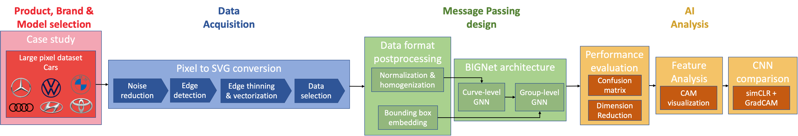
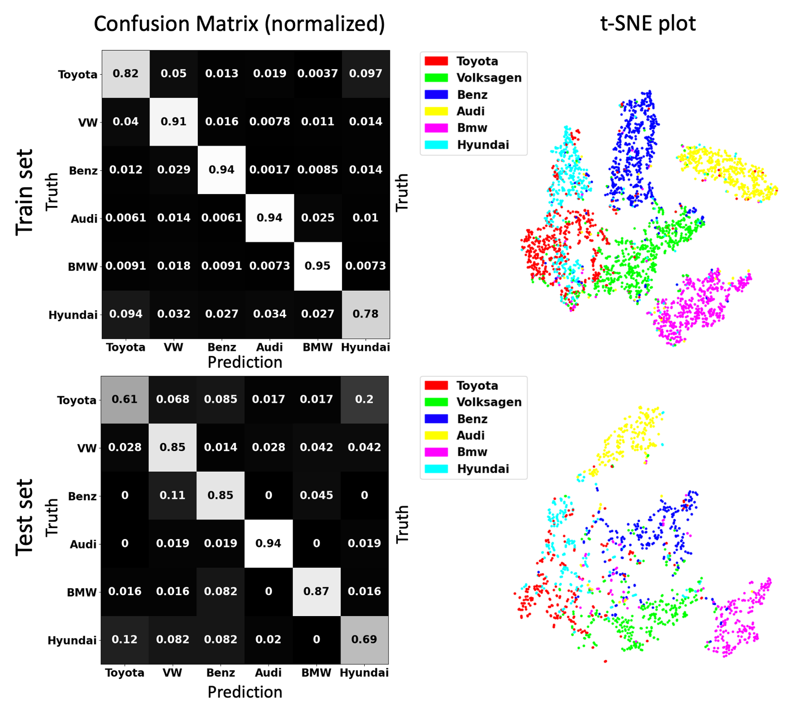
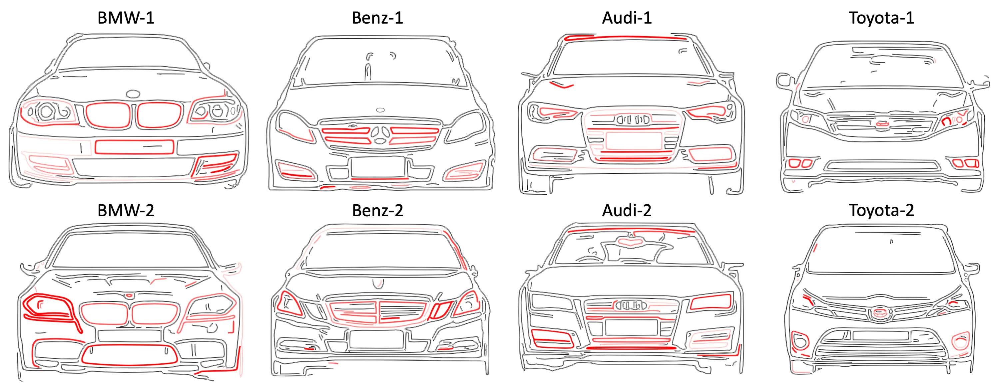

<!DOCTYPE html>
<html>
<head>
</head>
<body>

<h1>BIGNet - Car</h1>
<h4><a href="https://drive.google.com/file/d/1qFROn8uz7wG6HjcUkMC8Rdc0atgCuA22/view?usp=share_link">[Paper]</a></h4>

This page is the implementation of BIGNet in the car case study. Phone case study implementation can be found <a href="https://github.com/parksandrecfan/bignet-phone"><b>here</b>.

<h2>Project summary</h2>

Identifying and codifying brand-related aesthetic features for produc redesign is essential yet challenging, even for humans. This project demonstrates a deep learning, data-driven way to automatically learn brand-related features through SVG-based supervised learning, using brand identification graph neural network (<b>BIGNet</b>), a hierarichal graph neural network.

Our approach conducting the car study can be summarized in this flow chart. Note that this page is the implementation of training BIGNet rather than the image processing pipeline. It would allow one to train BIGNet from an SVG dataset (vectorized from a pixel dataset).

<h2>System requirements</h2>

This project runs on a Linux server.

More hardware information can be found in <b>Hardware Overview.txt</b>.

The required (Python) packages can be found in <b>requirements.txt</b>.

<h2>Visualization Inference Demo Instruction</h2>

1. Download this repo to your linux server. In your terminal:

<pre><code>git clone https://github.com/parksandrecfan/bignet-car.git</code></pre>

2. Install the python packages in requirements.txt on your linux machine.

Install miniconda <a href="https://docs.conda.io/projects/conda/en/latest/user-guide/install/linux.html">here</a> on your linux server if you haven't. Installing anaconda on a windows computer may also work.

In terminal:

<pre><code>
conda create -n BIGNet2
conda activate BIGNet2
pip install -r requirements.txt
</code></pre>

3. Directory Initialization. In terminal:

<pre><code>
cd biget-car
mkdir dataset
mkdir -p model/curve/6brands/random_sample_logo_2std-0/eval/723_epoch
</code></pre>

4. Download dataset <a href="https://drive.google.com/drive/folders/15r5ZrX-pmfTON0Nkw-s3MY-ZsEhez5ez?usp=share_link"><b>"full_set_separateavg_logo_2std"</b></a> and place the folder under "biget-car/dataset".

5. Download the trained BIGNet model <a href="https://drive.google.com/file/d/1RUOH6DCagOAhW18xjYa7030NMhxCXIPW/view?usp=sharing"><b>"rand_init_car_model 723 epochs_good test.pt"</b></a> and place it under "biget-car/curve/6brands/random_sample_logo_2std-0".

6. Calculate confusion matrix. In terminal:

<pre><code>
python acc_and_conf.py \
--dataset_name "full_set_separateavg_logo_2std" \
--model_folder "model/curve/6brands/random_sample_separateavg_logo_2std-0" \
--model_name "rand_init_car_model 723 epochs_good test.pt" \
--eval_folder "eval" \
--num_brands 6 \
--device 0 \
--epoch 723
</code></pre>

The confusion matrix can be found in directory "model/curve/6brands/random_sample_separateavg_logo_2std-0/eval/723_epoch". Train set is "train_conf.jpg" and test set is "test_conf.jpg".

7. Plot tSNE dimension reduction results. In terminal:

<pre><code>
python dim_red.py \
--model_folder "model/curve/6brands/random_sample_separateavg_logo_2std-0" \
--dataset_folder "full_set_separateavg_logo_2std" \
--eval_folder "eval" \
--model_name "rand_init_car_model 723 epochs_good test.pt" \
--epoch 723 \
--num_brands 6 \
--device 0 
</code></pre>

The confusion matrix and tSNE results show BMW, Benz, and Audi are found to achieve higher recognition rates/clustering compared to other brands. This finding matches the
optimized marketing strategy that luxurious cars value brand
consistency more than economy cars.<b></b>

8. Visualize the features. In terminal:

<pre>
  <code>
python cam_ablation.py \
--model_folder "model/curve/6brands/random_sample_separateavg_logo_2std-0" \
--model_name "rand_init_car_model 723 epochs_good test.pt" \
--dataset_folder "full_set_separateavg_logo_2std" \
--eval_folder "eval" \
--run_train 1 \
--run_test 1 \
--is_important 1 \
--epoch 723 \
--num_brands 6 
  </code>
</pre>

7. You're done! View the features in "model/curve/6brands/random_sample_separateavg_logo_2std-0/eval/723_epoch/ablation". Redness indicates the attention.

* Train set, brand-relevant: <b>train/group/important2</b>.

* Train set, brand-irrelevant: <b>train/group/unimportant2</b>.

* Test set, brand-relevant: <b>test/group/important2</b>.

* Test set, brand-irrelevant: <b>test/group/unimportant2</b>.

Here are a few visualization results. It is obvious that BIGNet captures luxury segments’ well-distinguishable car parts including grille, headlights and fog lights, while there are much fewer geometric clues on affordable cars (Toyota) that it has to rely on logo detection:

<b>-------------------More Detailed Documentation-------------------</b>

This instruction will go through how to train BIGNet on 6-brand car images that has logos. For variations of 10 brands and logo removal, and the comparison with pixel CNN (simCLR+gradCAM) results, please email me, Sean Chen, at yuhsuan2@andrew.cmu.edu and I'll be happy to provide more support!

<h3>SVG/nx9 Dataset</h3>

The dataset format that would be used down the pipeline is nx9, and it can be downloaded <a href="https://drive.google.com/file/d/1EhZq4pBseJuNEIUJ-KXauxGjvlZU9cOC/view?usp=share_link"><b>here</b></a>(has to decompress). Each pickle file is a nx9 numpy matrix that represents a car's front view like the image below. The one-to-one correspondence SVG files can be found <a href="https://drive.google.com/file/d/1zU_wg6gt2tVKp9Nh09x_-dqSyGOWK-K0/view?usp=share_link"><b>here</b></a>(has to decompress). The files that share the same names represent the same car image. 0,1,2,3 at the end of each filename indicates the 4 augmented images of the same car. The SVG files are provided to give users a glance of the images, and is not actually being used down the pipeline. (In addition, one could easily verify the correspondence using the nx92svg and svg2nx9 functions in "preprocess.py" to convert between the two data format).

<b>The following pipeline places the decompressed nx9 folder under "dataset/" directory.</b>

<h3>Preprocess nx9 data for BIGNet</h3>

The process to convert the SVG (nx9 numpy) dataset to a BIGNet-friendly format is done in "svg2bignet.py". <b>First, download "<a href="https://drive.google.com/file/d/1AKov83vd_zc_PVQo2Lg3yVdfkmuxcvPx/view?usp=share_link"><b>train_test_split_names.pkl</b></a>" and place it in "full_set_folder" directory</b> (here, we use "full_set_separateavg_logo_2std" as the name of the "full_set_folder"). Then, run this example command to type in the terminal:
 

<pre>
  <code>
python svg2bignet.py \
--full_set_folder \
full_set_separateavg_logo_2std \
--dataset_folder dataset \
--nx9_folder nx9 \
--format ".pkl”
  </code>
</pre>

The command would return 6 files, including "data_ids.pkl", "svg_lists.pkl", "cors.pkl", "labels.pkl", "curve_tensors.pkl", and "curve_labels.pkl" also in "full_set_folder".

The paths are:
nx9 dataset: dataset/nx9
BIGNet formatted dataset: dataset/full_set_separateavg_logo_2std/*.pkl

you may also just skip this preprocessing section by doing step 4 in the demo section above to download the processed data directly, and place it in a folder named "dataset".

<h3>Training</h3>

To train with 6 brands cars with logos using the first GPU of your device, download <a href="https://drive.google.com/file/d/1hwrOMvQraFToymJT_aeyu4tIsIgNdAqm/view?usp=share_link"><b>"full_dataset_separateavg_logo_2std.txt"</a> and place it in the main directory. Also, make a folder named "model" to store your trained BIGNet model</b>. Then, run python train.py in terminal. For example, Type the following command in terminal:

<pre>
  <code>
python train.py \
--dataset_names_path "full_dataset_separateavg_logo_2std.txt" \
--full_set_folder "full_set_separateavg_logo" \
--model_folder "model/curve/6brands/random_sample_separateavg_logo_2std-0" \
--brands 6 \
--device 0
  </code>
</pre>
Your trained model, and train/test loss and accuracy history will be stored in the model_folder directory. The paths are:

dataset: "dataset/full_set_separateavg_logo_2std"

models: "model/curve/6brands/random_sample_separateavg_logo_2std-0/*.pt

<h3>Accuracy and confusion matrix</h3>
To know the accuracy and confusion matrix of a desired BIGNet model, run "acc_and_conf.py". For example, type this in terminal:
<pre>
  <code>
python acc_and_conf.py \
--dataset_name "full_set_separateavg_logo_2std" \
--model_folder "model/curve/6brands/random_sample_separateavg_logo_2std-0" \
--model_name "rand_init_car_model 723 epochs_good test.pt" \
--eval_folder "eval" \
--num_brands 6 \
--device 0 \
--epoch 723
  </code>
</pre>

In this snippet, it calculates the confusion matrix of a given dataset and model, and save the train/test accuracy curve, loss curve and confusion matrix plots in directory.

The paths are:

model: "model/curve/6brands/random_sample_separateavg_logo_2std-0/rand_init_car_model 723 epochs_good test.pt"

dataset: "dataset/full_set_separateavg_logo_2std"

evaluation folder: "model/curve/6brands/random_sample_separateavg_logo_2std-0/eval/723_epoch"

The pretrained model of "rand_init_car_model 723 epochs_good test.pt" can be downloaded <a href="https://drive.google.com/file/d/1RUOH6DCagOAhW18xjYa7030NMhxCXIPW/view?usp=share_link"><b>here</b></a>
 for one to test.

<h3>Dimension Reduction</h3>

Dimension reduction of 2D/3D PCA/tSNE is done in "dim_red.py". For example, type this in terminal:

<pre>
  <code>
python dim_red.py \
--model_folder "model/curve/6brands/random_sample_separateavg_logo_2std-0" \
--dataset_folder "full_set_separateavg_logo_2std" \
--eval_folder "eval" \
--model_name "rand_init_car_model 723 epochs_good test.pt" \
--epoch 723 \
--num_brands 6 \
--device 0 
  </code>
</pre>

In this snippet, it outputs the train/test sets' 2D tsne/PCA plots in evaluation folder. The paths are identical to the <b>Accuracy and confusion matrix</b> section.

<h3>cam-ablation studies</h3>

Visualization of brand-related features are implemented in "cam_ablation.py". For example, type this in terminal:

<pre>
  <code>
python cam_ablation.py \
--model_folder "model/curve/6brands/random_sample_separateavg_logo_2std-0" \
--model_name "rand_init_car_model 723 epochs_good test.pt" \
--dataset_folder "full_set_separateavg_logo_2std" \
--eval_folder "eval" \
--run_train 1 \
--run_test 1 \
--is_important 1 \
--epoch 723 \
--num_brands 6 
  </code>
</pre>

In this snippet, it outputs the brand-relevant/irrelevant features of the desired model on each sample in dataset. The paths are:

model: "model/curve/6brands/random_sample_separateavg_logo_2std-0/rand_init_car_model 723 epochs_good test.pt"

dataset: "dataset/full_set_separateavg_logo_2std"

ablation folder: "model/curve/6brands/random_sample_separateavg_logo_2std-0/eval/723_epoch/ablation"

brand-relevant images: ablation folder + train/test + group/important2

brand-irrelevant images: ablation folder + train/test + group/unimportant2

For any questions implementing, feel free to email Sean Chen as yuhsuan2@andrew.cmu.edu

</body>
</html>
